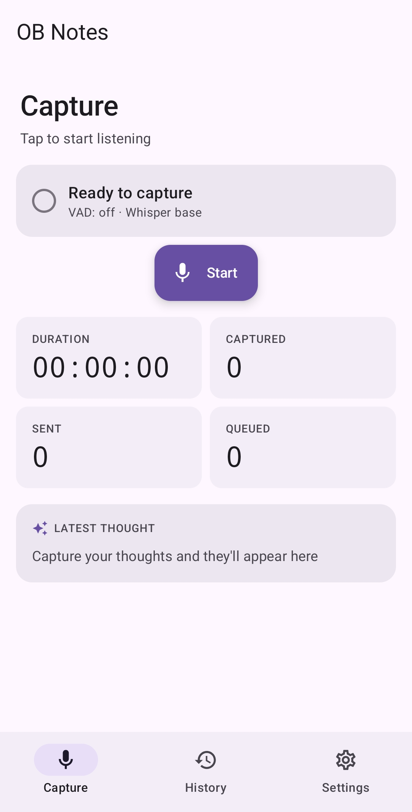
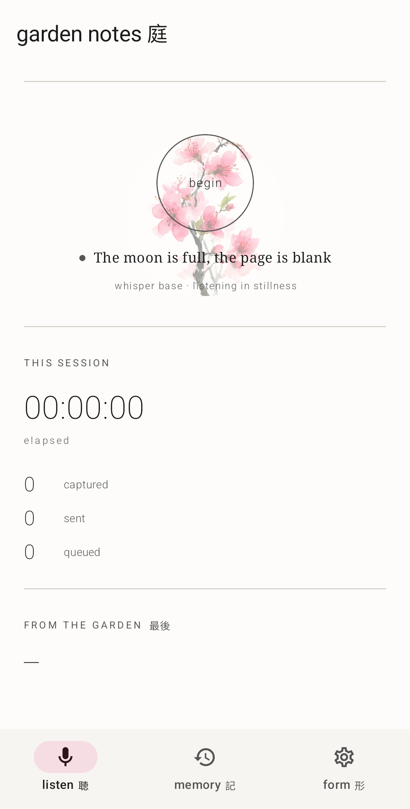
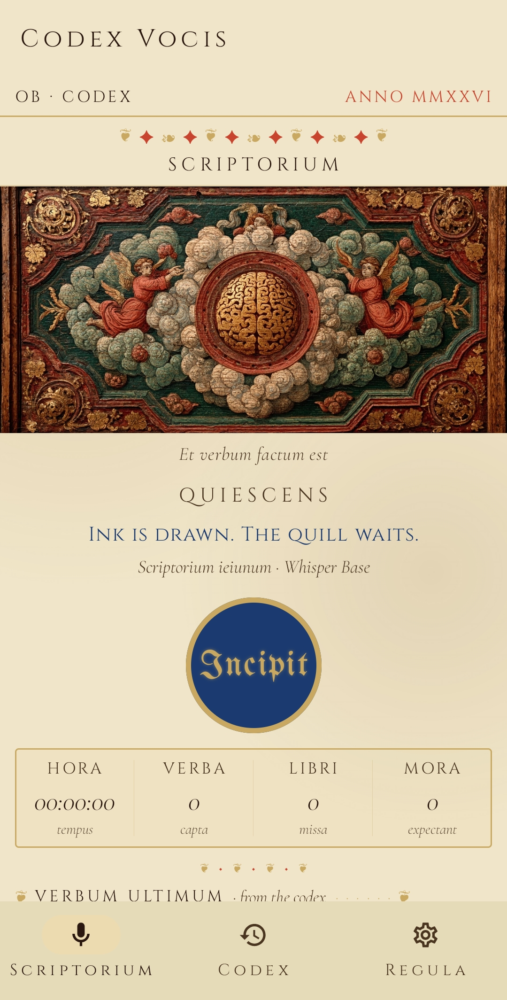
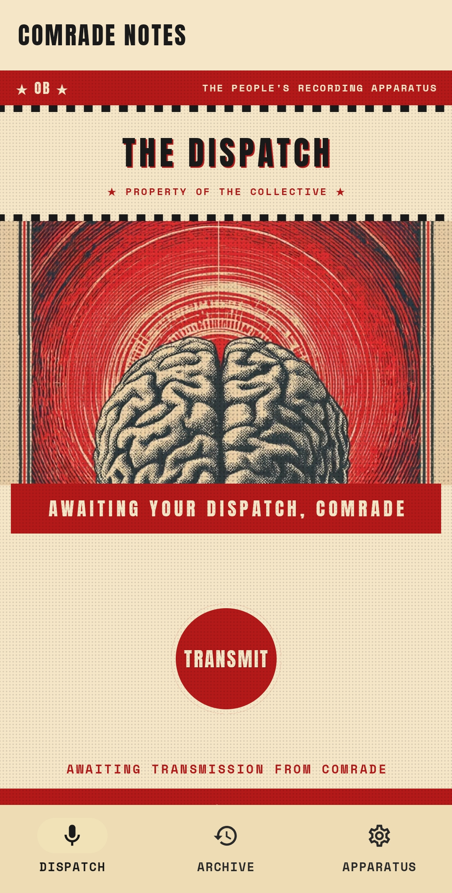

# Open Brain Capture (Android)

A voice-capture Android client for [Open Brain (OB1)](https://github.com/) — your personal persistent memory layer. Press a button (in-app, Quick Settings tile, or home-screen widget), speak a thought, and the app:

1. Records audio in a foreground service so it keeps running with the screen off.
2. Transcribes locally on-device using [whisper.cpp](https://github.com/ggerganov/whisper.cpp) — nothing leaves your phone until you choose to sync.
3. Pushes the transcribed thought to your OB1 backend over JSON-RPC / SSE.

Everything user-specific (backend URL, access key, Whisper model size, audio retention) is configured in the in-app **Settings** screen — there is nothing to edit in source.

## Screenshots

The capture screen, shown across the four built-in themes (switch from Settings):

| Default | Garden | Codex | Comrade |
|:---:|:---:|:---:|:---:|
|  |  |  |  |

## Install the APK

1. Download the latest `app-release.apk` from the [Releases page](../../releases).
2. On your Android device, open **Settings → Security → Install unknown apps** (wording varies by Android version) and allow the browser or file-manager app you'll open the APK from.
3. Tap the downloaded APK and confirm the install.
4. Open Open Brain → **Settings** and paste your OB1 endpoint URL and access key.

Updates: future signed releases install over the existing one as long as they're signed with the same key. If you ever see "package conflicts with existing package", uninstall first.

## Permissions

| Permission | Why |
|---|---|
| `RECORD_AUDIO` | Capture your voice — the whole point of the app. |
| `POST_NOTIFICATIONS` | Show the persistent capture-in-progress notification (required for a foreground service). |
| `FOREGROUND_SERVICE` + `FOREGROUND_SERVICE_MICROPHONE` | Keep recording when the screen is off or another app is foregrounded. |
| `INTERNET` + `ACCESS_NETWORK_STATE` | Sync transcribed thoughts to your OB1 backend. |
| `WAKE_LOCK` | Prevent the CPU from sleeping mid-capture and dropping audio. |

The app does not request location, contacts, storage, or any ad/analytics permissions.

## Backend

This app is a **client**. You need an OB1 backend reachable over HTTPS that speaks JSON-RPC over SSE. Endpoint and access key are entered in the in-app Settings screen.

## Build from source

**Requirements**

- Android Studio (Hedgehog or newer)
- JDK 17
- Android SDK 34
- Android NDK `30.0.14904198`
- minSdk 26 (Android 8.0+)
- Target device or emulator: `arm64-v8a` only

**Debug build** (no keystore needed)

```bash
./gradlew assembleDebug
adb install -r app/build/outputs/apk/debug/app-debug.apk
```

**Release build** (signed APK for distribution)

1. Generate a release keystore once and keep it somewhere safe (1Password, encrypted backup — losing it means future builds can't update existing installs):

   ```bash
   keytool -genkey -v -keystore openbrain-release.keystore \
     -alias openbrain -keyalg RSA -keysize 2048 -validity 10000
   ```

2. Copy `keystore.properties.example` to `keystore.properties` and fill in your passwords. Both files (`*.keystore` and `keystore.properties`) are gitignored.

3. Build:

   ```bash
   ./gradlew assembleRelease
   ls app/build/outputs/apk/release/app-release.apk
   ```

4. Verify the signature is your release key, not the Android debug key:

   ```bash
   keytool -printcert -jarfile app/build/outputs/apk/release/app-release.apk
   ```

## License

MIT — see [LICENSE](LICENSE).

Bundled [whisper.cpp](https://github.com/ggerganov/whisper.cpp) is also MIT-licensed.
